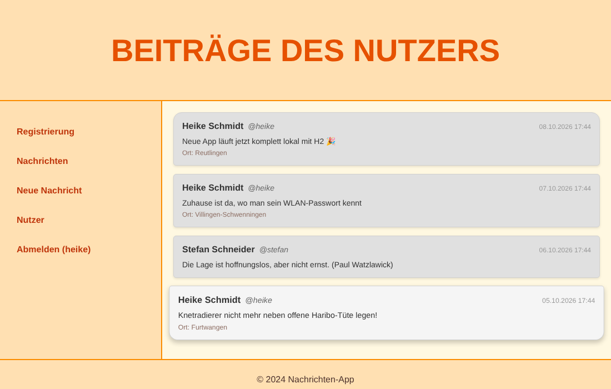

# Messages – Nachrichten-App

A small Twitter-style message board built with **Spring Boot**, **Thymeleaf**, **Spring Security** and **jQuery/Ajax**. Users can register, log in, write short messages with their location, and watch new posts appear live without reloading the page.



## Features

- **Registration and login** with Spring Security. Passwords are stored as BCrypt hashes.
- **Write messages** (max. 140 characters). The location can be filled in automatically with the browser's geolocation and OpenStreetMap.
- **Live message list:** new posts appear every second through an Ajax endpoint (`/ajax/messages.json`), with no page reload.
- **User list** showing everyone who has registered.
- **Server-rendered pages** with Thymeleaf, shared header, navigation and footer as fragments, and a two-column layout.
- **Embedded H2 database:** runs out of the box with no external server, and comes with demo data.

## Tech stack

| Layer | Technology |
|---|---|
| Backend | Java 17, Spring Boot 2.7, Spring Web MVC |
| Security | Spring Security (form login, BCrypt) |
| Views | Thymeleaf + Thymeleaf Spring Security extras |
| Database | H2 (embedded) via plain JDBC |
| Frontend | HTML5, CSS3 (Flexbox, transitions, web fonts), jQuery, Ajax, PowerTip tooltips |

## Getting started

Requirements: **Java 17+** and **Maven**. IntelliJ IDEA or Eclipse can also import the project directly as a Maven project.

```bash
git clone https://github.com/<your-username>/messages-app.git
cd messages-app
mvn spring-boot:run
```

Then open <http://localhost:8080/nachrichtenListe.html>.

### Demo accounts

When the database is empty, the app creates two users with a few messages:

| Username | Password |
|---|---|
| `heike` | `demo` |
| `stefan` | `demo` |

Or register your own account under **Registrierung**.

### Keeping data between restarts

By default the database lives in memory, so every restart starts fresh with the demo data. To keep your data, change this line in `src/main/resources/application.properties`:

```properties
app.datasource.url=jdbc:h2:file:./data/messages
```

## Pages

| URL | Description | Login required |
|---|---|---|
| `/nachrichtenListe.html` | All messages, updated live | no |
| `/messageForm.html` | Write a new message | yes |
| `/registerForm.html` | Create an account | no |
| `/users.html` | All registered users | no |
| `/login.html` | Log in | no |
| `/messages-.html` | Plain message list rendered by a raw servlet (from the servlet exercise) | no |

## Project structure

```
src/main/java/de/hfu/
├── MessageApp.java              Spring Boot entry point
├── MeinController.java          MVC controller: pages, forms, Ajax endpoint
├── SecurityConfiguration.java   login, logout, protected pages, BCrypt
├── MessageListServlet.java      plain servlet version of the message list
├── MessagePrinter.java          prints all messages to the console at startup
├── config/
│   ├── DatabaseConfiguration.java   H2 connection pool + schema setup
│   └── DemoData.java                demo users and messages
├── model/                       User, Message
└── service/
    ├── MessageService.java          service interface
    └── JdbcMessageService.java      H2/JDBC implementation
src/main/resources/
├── templates/                   Thymeleaf views + shared fragments
├── static/                      CSS, JavaScript, and the original static HTML mockups
└── schema.sql                   database tables
```

## Background

I built this app step by step in the **Software Engineering 2** lab at Hochschule Furtwangen: static HTML/CSS mockups first, then JavaScript, Spring, servlets, Spring MVC, Spring Security and finally Ajax.

In the course, users and messages were stored on a central university server that the app called through Spring remoting. That backend was only meant for the course, so I replaced it with my own service layer on an embedded H2 database, which makes the app run on its own. The controller, views and Ajax code stayed the same, because the new `MessageService` keeps the same methods as the old remote one.
